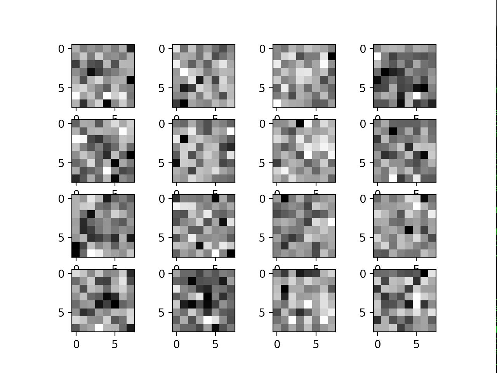
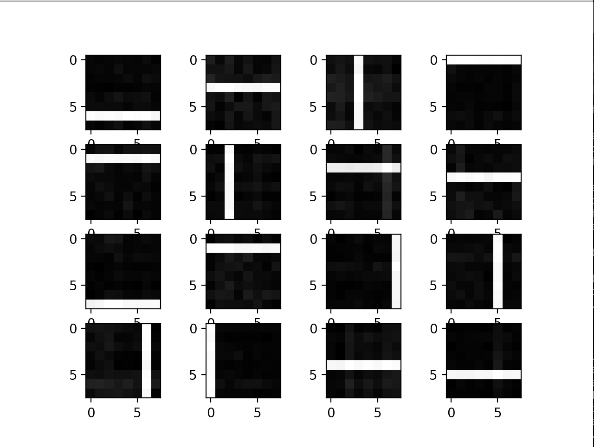
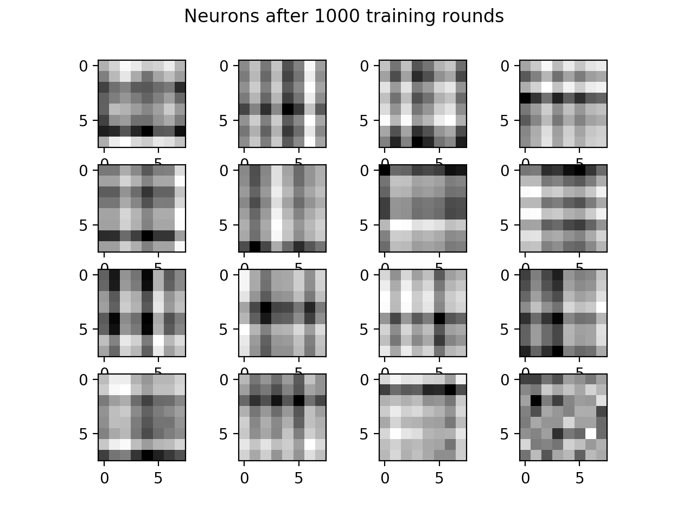

# Sparse Representations by Local Anti-Hebbian Learning
This is an experiment based on [Peter Foldiak's work](https://redwood.berkeley.edu/wp-content/uploads/2018/08/foldiak90.pdf) on developing sparse codes. We can take a single layer of neurons (perceptrons) and add anti-Hebbian feedback connections between them that can learn to code patterns in such a way that statistical dependency between the elements of the representation is reduced while preserving information. Even this simple network is shown to learn the independent patterns of the dataset, providing a simple alternative to PCA.

Neurons are initialized randomly and look like so:

I then trained on a series of "bar" images, which look like so.

Interestingly, it only takes a one-layer perceptron network with 16 neurons and no knowledge of the dataset to recover the dataset. The feedforward connections developed so that the units became detectors of the most common, highly correlated components (lines). All information is preserved and virtually all redundancy is removed by the inhibitory weights, as the outputs are statistically independent.

In contrast, PCA does not even come close to learning the bars

